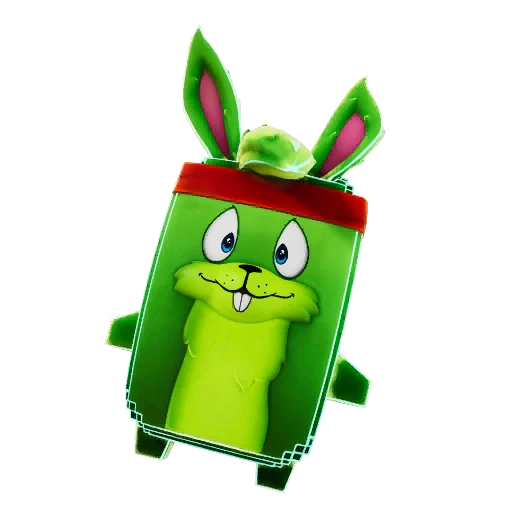

# ⚡ Fortnite Sprites Tracker & OBS Overlay (Glitch Season)

<p align="center">
  
</p>

<p align="center">
  <a href="https://fortnite.gg/sprites"></a>
  <a href="https://www.python.org/"></a>
  <a href="https://fastapi.tiangolo.com/"></a>
  <a href="https://obsproject.com/"></a>
  <a href="LICENSE"></a>
</p>

<p align="center">
  <b>🇹🇷 Türkçe & 🇬🇧 English Bilingual Support</b>
</p>

---

## 🇹🇷 TÜRKÇE

### 📖 Genel Bakış
**Fortnite.GG** üzerindeki tüm Sprite'ları (153 adet), varyantları, düşme oranlarını ve unreleased karakterleri canlı takip edip canlı yayınlarınızda (**OBS Studio**) şık bir Cyberpunk / Glitch animasyonlu widget olarak sergilemenizi sağlayan yerel yönetim paneli ve yayın overlay sistemi.

### ✨ Özellikler
- 👾 **Glitch / Override Teması:** Cyber Grid ızgara deseni, CRT TV Scanlines efektleri, kromatik RGB glitch animasyonları ve neon ışıklandırmalar.
- 🃏 **OBS 3x3 Dönüşümlü Grid:** Canlı yayında 3x3 (9 kart) formatında devasa 3D karakter modelleri ve 9'dan fazla eksik olduğunda akıcı sayfa rotasyonu (**Carousel/Pagination**).
- 🎞️ **OBS Kayan Kartlar (Ticker):** Kesintisiz akan yatay eksik kart bandı.
- 📊 **OBS Banner / HUD:** Kompakt ilerleme çubuğu ve eksik/toplanan sayaçları.
- 🔄 **Canlı Sıfır Gecikme (0ms Live Sync):** Yönetim panelinde işaretlediğiniz sprite'lar OBS Studio'da anında güncellenir.
- 🌐 **İki Dilli Destek:** Türkçe 🇹🇷 ve İngilizce 🇬🇧 tam arayüz desteği.
- ⚡ **Fortnite.GG Canlı Otomasyon:** Uygulama açılışında otomatik senkronizasyon ve tek tıkla canlı güncelleme.
- 📦 **Tek Tıkla Taşınabilir EXE:** Python kurulumu gerektirmeden arka planda sistem tepsisinde çalışan bağımsız `.exe`.

### 🚀 Hızlı Başlangıç

#### Seçenek 1: Bağımsız `.exe` ile (Python Gerektirmez)
1. **[Releases](https://github.com/FNFest-TR/sprites/releases)** bölümünden veya ana dizindeki **[`FortniteSpritesTracker.exe`](./FortniteSpritesTracker.exe)** dosyasını çalıştırın.
2. Siyah konsol penceresi açılmaz; sistem tepsisinde (sağ altta) sessizce çalışır ve tarayıcınızda otomatik olarak yönetim panelini (**`http://127.0.0.1:8765`**) açar.

#### Seçenek 2: Kaynak Koddan Çalıştırma (Python 3.10+)
```bash
# 1. Depoyu klonlayın
git clone https://github.com/FNFest-TR/sprites.git
cd sprites

# 2. Gerekli kütüphaneleri yükleyin
pip install -r requirements.txt

# 3. Uygulamayı başlatın
python tray_app.py
```

### 📺 OBS Studio Entegrasyonu

OBS Studio'da **Kaynaklar (Sources) -> Ekle (+) -> Tarayıcı (Browser)** seçeneğini ekleyip aşağıdaki linklerden birini yapıştırın:

| Görünüm Modu | OBS Tarayıcı URL'si | Önerilen OBS Boyutu (W x H) |
| :--- | :--- | :--- |
| **🃏 3x3 Glitch Grid (Önerilen)** | `http://127.0.0.1:8765/obs?mode=grid&season=42&lang=tr` | `500 x 500` |
| **🎞️ Kayan Kartlar (Ticker)** | `http://127.0.0.1:8765/obs?mode=ticker&season=42&lang=tr` | `1920 x 240` |
| **📊 İlerleme Banner'ı (HUD)** | `http://127.0.0.1:8765/obs?mode=banner&season=42&lang=tr` | `490 x 140` |

---

## 🇬🇧 ENGLISH

### 📖 Overview
A real-time Sprite collection tracker and OBS Studio stream overlay system designed for **Fortnite Chapter 7 Season 4 (Glitch / Override Season)**. Tracks all 153 sprites, variants, rarities, drop chances, and unreleased assets directly from Fortnite.GG.

### ✨ Features
- 👾 **Glitch / Override Aesthetic:** Cyber Grid background, CRT TV Scanlines, RGB chromatic glitch animations, and neon cyberpunk glows.
- 🃏 **OBS 3x3 Rotating Grid:** Stream-optimized 3x3 (9 cards) layout featuring extra-large 3D character models and smooth auto-cycling pagination when missing sprites exceed 9.
- 🎞️ **OBS Smooth Ticker:** Infinite horizontal scrolling marquee for missing sprites.
- 📊 **OBS Banner / HUD:** Compact progress bar with collection counters.
- 🔄 **0ms Zero-Latency Sync:** Instant updates across OBS Browser Sources when checking items on the dashboard.
- 🌐 **Dual Language Support:** Full Turkish 🇹🇷 & English 🇬🇧 localization.
- ⚡ **Fortnite.GG Auto-Sync:** One-click & startup background sync for newly added sprites.
- 📦 **Zero-Config Standalone EXE:** Lightweight portable `.exe` running in the system tray with no Python installation needed.

### 🚀 Quick Start

#### Option 1: Standalone `.exe` (No Python Needed)
1. Download **[`FortniteSpritesTracker.exe`](./FortniteSpritesTracker.exe)** from the **[Releases](https://github.com/FNFest-TR/sprites/releases)** page.
2. Double-click to launch. It runs quietly in the Windows system tray and opens `http://127.0.0.1:8765` in your browser.

#### Option 2: Run from Source (Python 3.10+)
```bash
# 1. Clone the repository
git clone https://github.com/FNFest-TR/sprites.git
cd sprites

# 2. Install dependencies
pip install -r requirements.txt

# 3. Start the application
python tray_app.py
```

### 📺 OBS Studio Browser Source Setup

In OBS Studio, add a **Browser Source** and enter one of the following URLs:

| View Mode | OBS Browser Source URL | Recommended Size (W x H) |
| :--- | :--- | :--- |
| **🃏 3x3 Glitch Grid (Recommended)** | `http://127.0.0.1:8765/obs?mode=grid&season=42&lang=en` | `500 x 500` |
| **🎞️ Smooth Ticker** | `http://127.0.0.1:8765/obs?mode=ticker&season=42&lang=en` | `1920 x 240` |
| **📊 Progress Banner (HUD)** | `http://127.0.0.1:8765/obs?mode=banner&season=42&lang=en` | `490 x 140` |

---

## 📂 Project Structure

```
sprites/
├── app.py                     # FastAPI backend & state API
├── fetch_sprites.py           # Fortnite.GG scraper & asset downloader
├── tray_app.py                # System tray runner & startup sync
├── start.bat                  # Windows batch launcher
├── FortniteSpritesTracker.exe # Standalone Windows executable
├── requirements.txt           # Python dependencies
├── data/
│   └── sprites.json           # 153 sprites metadata database
└── static/
    ├── index.html             # Manager Dashboard UI
    ├── obs_widget.html        # OBS Studio Browser Source Overlay
    ├── css/                   # Glitch & Cyberpunk styles
    ├── js/                    # Real-time sync & widget logic
    └── images/                # 153 high-res .webp sprite icons
```

---

## 📄 License
This project is licensed under the [MIT License](LICENSE). Fortnite and all associated assets are trademarks and property of Epic Games.
